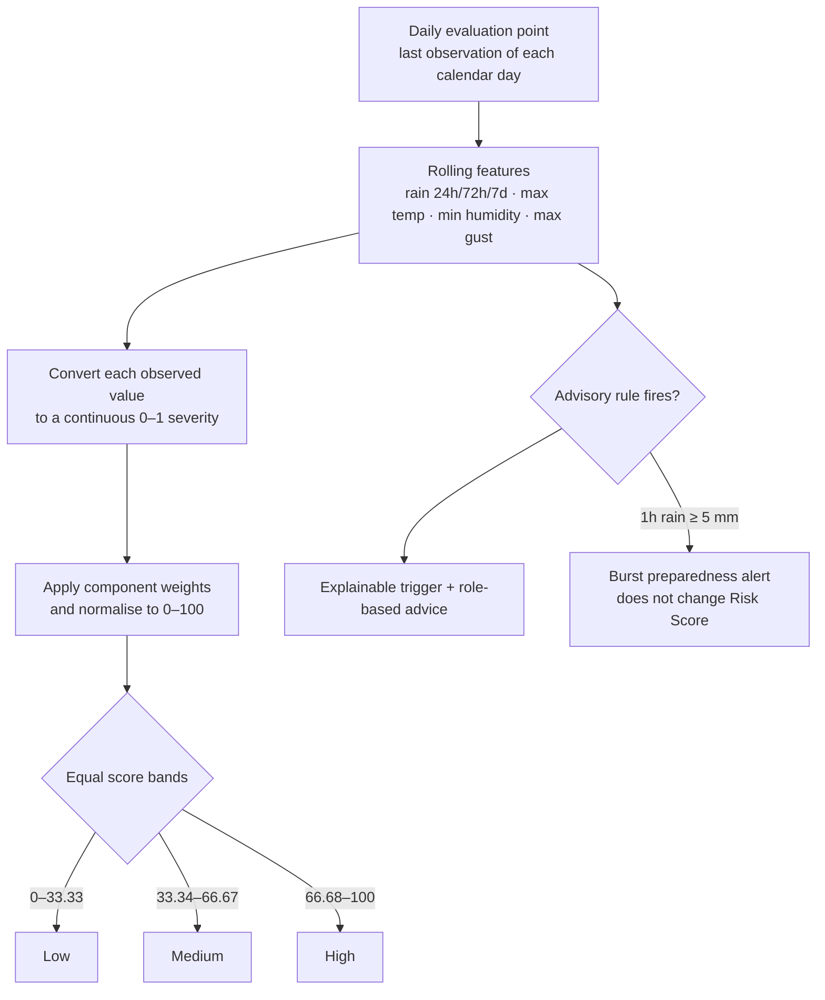
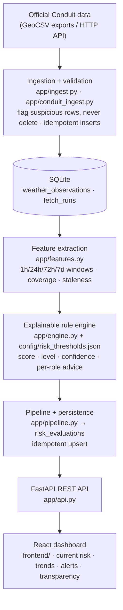

# MajiGuard


**Community water-stress risk and action guidance — a Hack The Weather prototype.**

MajiGuard turns raw environmental observations from the official **Conduit@Empathy** station (JKUAT, Kiambu, Kenya) into clear, explainable, role-aware guidance. Instead of another raw weather chart, it answers one question: *given the last few hours and days of rainfall, temperature, humidity and wind — what should residents, farmers, and site managers actually do right now?*

Every result ships with three things: a **continuous 0–100 risk score** derived from observable sensor conditions, a **confidence value** that reflects data quality, and **action recommendations written per role** — so a farmer, a resident, and a water manager each get advice that makes sense for them.

> **Scope boundary (important):** the MVP only uses fields that actually exist in the official Conduit data. We do **not** claim to measure water quality, water volume, flood probability, actual crop water demand, or health risk. Those remain future directions until the data can support them.

---

## 1. Problem

Environmental sensor dashboards show numbers, not decisions. A chart of rain-gauge readings does not tell a farmer whether it is safe to delay irrigation, or tell a manager whether staff should limit outdoor work during a hot, dry spell. The gap between *raw observation* and *prudent action* is exactly where MajiGuard sits.

## 2. Solution

MajiGuard converts recent Conduit observations into:

- **Risk Score (0–100)** — a continuous weighted index built from rainfall deficit, heat, humidity and wind severity. It changes with the observed values rather than only when a binary rule switches on or off.
- **Risk Level** — the 0–100 index split into equal thirds: `Low` (0–33.33), `Medium` (33.34–66.67), and `High` (66.68–100).
- **Confidence (0–1.0)** — penalised by low sampling coverage, flagged/invalid rows, missing critical features, and stale data, so consumers know how much to trust a result.
- **Triggered rules** — each with a human-readable description, the observed values, and per-role recommendations.
- **Action recommendations per role** — separate guidance for *residents*, *farmers*, and *managers*, built from level templates plus rule-specific advice.
- **Alerts & trends** — burst-rain preparedness alerts, risk score over time, per-metric trends (rain / temperature / wind / humidity), and a data-transparency page for judges to verify exactly how Conduit data is used.

## 3. How the risk score works

The current engine uses a transparent **continuous weighted index (rules version 3.0.0)**. It does not add a fixed number only when a rule fires. Instead, every scoring input is converted to a severity between 0 and 1 from its observed sensor value, then multiplied by its configured weight. All parameters live in the versioned config file [`backend/config/risk_thresholds.json`](backend/config/risk_thresholds.json).

For component `i`:

```text
severity_i = clamp(
    (observed_i - low_risk_value_i)
    / (high_risk_value_i - low_risk_value_i),
    0,
    1
)

Risk Score = 100 × Σ(severity_i × weight_i) / Σ(available weights)
```

`low_risk_value` and `high_risk_value` describe direction as well as range. For rainfall and humidity, the high-risk value is lower than the low-risk value, so less rain or lower humidity produces a larger severity. Values outside a configured range are clamped; the final score therefore always stays between 0 and 100.



### 3.1 Continuous scoring components (v3.0.0)

The six weights total 100 when every input is present:

| Component | Source feature | Low-risk value (0 severity) | High-risk value (1 severity) | Weight |
|---|---|---:|---:|---:|
| 24h rainfall deficit | `rainfall_24h_mm` | 5.0 mm | 0.0 mm | 15 |
| 72h rainfall deficit | `rainfall_72h_mm` | 15.0 mm | 0.0 mm | 20 |
| 7-day rainy-day deficit | `rain_days_7d` | 3 days | 0 days | 10 |
| Heat exposure | `temp_max_24h_c` | 18 °C | 35 °C | 25 |
| Dry-air exposure | `humidity_min_24h_pct` | 80 % | 30 % | 20 |
| Wind evaporation exposure | `wind_gust_max_24h_ms` | 2 m/s | 12 m/s | 10 |

If a scoring feature is missing, that component is excluded and the available weights are re-normalised. Missing data still lowers the separate confidence value, so a score is never presented as equally trustworthy when its evidence is incomplete.

**Worked example:** for 0 mm rain in 24h, 3 mm in 72h, one rainy day in 7d, a 28 °C daily maximum, 45 % minimum humidity and a 6 m/s maximum gust:

```text
24h rain deficit     1.00 × 15 = 15.0
72h rain deficit     0.80 × 20 = 16.0
rainy-day deficit    0.67 × 10 =  6.7
heat exposure        0.59 × 25 = 14.7
dry-air exposure     0.70 × 20 = 14.0
wind exposure        0.40 × 10 =  4.0
                                  ────
Risk Score                       = 70.4 → High
```

### 3.2 Daily calculation and dashboard aggregation

MajiGuard calculates one evaluation for every calendar day containing observations. Each daily evaluation ends at that day's final observation and uses only data available up to that time; future observations cannot leak into a historical score.

The home-page overview uses the latest seven daily evaluations:

- the **donut chart** counts how many days were `Low`, `Medium`, or `High`;
- the **line chart** plots the exact 0–100 Risk Score for each day.

The distribution is an observed historical day count, not a forecast probability.

### 3.3 Advisory triggers (separate from score calculation)

The following binary rules remain for explanations and role-specific recommendations. In v3.0.0 they do **not** add fixed points to the continuous Risk Score.

| Rule | Advisory condition |
|---|---|
| `dry_72h` | 72h rainfall ≤ 2.0 mm |
| `dry_7d_baseline` | ≤ 1 rainy day in the last 7 days |
| `hot_and_dry` | 24h max temp ≥ 30 °C **and** 24h min humidity ≤ 40 % |
| `hot_exposure` | 24h max temp ≥ 32 °C |
| `windy_and_hot` | 24h max gust ≥ 10 m/s **and** 24h max temp ≥ 28 °C |
| `rain_burst_1h` | 1h rainfall ≥ 5.0 mm; standalone preparedness alert |

### 3.4 Confidence — how much to trust this result

Confidence starts at 1.0 and is reduced by transparent penalties:

| Data problem | Penalty |
|---|---|
| Low sampling coverage in the past 24h | − (1 − coverage) × 0.3 |
| Rows flagged invalid in the past 24h | − invalid ratio × 0.5 |
| Missing values (completeness) | − (1 − completeness) × 0.4 |
| Data older than 120 min | − 0.1 per hour, max 0.5 |
| Critical feature missing (24h/72h rainfall) | − 0.15 each |
| Data older than 720 min | hard cap at 0.3 |

Confidence never changes the score — it travels *alongside* it, so downstream users can decide how much to weigh the advice.

## 4. Role-based advisories — who should do what, and when

Every evaluation produces advice for three audiences. It is assembled in two layers: first a **level template** (what everyone at this risk level should do), then **rule-specific advice** for each triggered critical value (deduplicated).

### 4.1 Level templates

| Level | Residents | Farmers | Managers |
|---|---|---|---|
| **Low** | Keep your normal water habits | Follow your usual irrigation plan; watch upcoming weather | No extra action; keep monitoring |
| **Medium** | Start saving water and confirm storage is sufficient | Optimize irrigation timing; prioritize key crops | Consider a community water-saving notice; check storage facilities |
| **High** | Save water now; prepare storage; follow updates from local authorities | Pause non-critical irrigation; secure drinking water and key crops first | Issue a community alert; prioritize supply and storage checks |

### 4.2 Rule-specific advice (critical value → role action)

| Triggered critical value | Residents | Farmers | Managers |
|---|---|---|---|
| 72h rain ≤ 2.0 mm | Review non-essential water use; consider safe storage | Review irrigation schedules vs actual soil moisture | Watch the dry trend; consider a water-saving reminder |
| ≤ 1 rainy day in 7d | Watch storage levels; avoid waste | Assess upcoming irrigation needs; avoid midday watering | Check community water sources and storage |
| Temp ≥ 30 °C & humidity ≤ 40 % | Shift outdoor watering to early morning or evening | Irrigate early or late; mulch soil to cut evaporation | Remind residents to schedule water use around peak heat |
| Temp ≥ 32 °C | Cut non-essential water use during peak heat | Watch drinking-water needs of crops and livestock | Monitor water-supply load during hot periods |
| Gust ≥ 10 m/s & temp ≥ 28 °C | Cover open water containers (evaporation, dust) | Avoid spray irrigation in hot, windy periods | Check storage facilities for wind-related losses |
| **Burst:** 1h rain ≥ 5.0 mm | Check rooftop collection and containers; get ready to harvest rain | Check field drainage to avoid waterlogging | Check drainage channels; alert the community about intense rain |

The burst rule is a standalone preparedness heads-up: it never raises the stress score, but it always appears in the triggers and advice when it fires.

## 5. How we use Conduit data

| Used for | Fields | Notes |
|---|---|---|
| Rainfall windows (1h / 24h / 72h / 7d) | `rg1`, `rg2` | Per-interval tipping-bucket readings; window rain = SUM(rg1 + rg2) over valid rows. |
| Heat rules | `temp_sht`, `humidity_sht` | SHT temperature/humidity sensor as primary ambient inputs. |
| Wind rule | `wind_spd`, `wind_gust` | Gust used for the windy-and-hot rule; must be non-negative. |
| Quality / confidence | `is_valid`, `quality_flags_json`, timestamp cadence | Suspicious rows are **flagged, never silently deleted**; staleness and coverage feed the confidence score. |

Validation rules (ranges, negative values, humidity 0–100) are documented in [`backend/doc/data-dictionary.en.md`](backend/doc/data-dictionary.en.md). The known data anomaly (`wind_gust_dir` ≡ `wind_gust`) is explicitly excluded from calculations.

**Data source & attribution:** all observations come from the official **Conduit@Empathy** environmental data station (3DFEWSNET, Site JKUAT, Kiambu, Kenya), provided by the Hack The Weather organisers, sampled at ~15-minute intervals. We thank the Conduit team for making this data available. No other external data sources are used in the MVP.

## 6. Tech stack

| Layer | Technology |
|---|---|
| Backend | Python 3.12+, FastAPI, Uvicorn |
| Storage | SQLite (`weather_observations`, `fetch_runs`, `risk_evaluations`) |
| Rules / features | Pure-Python rule engine + SQL aggregation (no heavy deps) |
| Frontend | React 19 + TypeScript + Vite, Tailwind CSS 4, Recharts |
| Testing | Pytest (32 tests: features, engine, ingest, pipeline, API) |

## 7. Architecture



## 8. Repository structure

```text
WheaterHack/
├── RainData/                        # Official Conduit GeoCSV exports (JKUAT station)
├── backend/
│   ├── app/
│   │   ├── db.py                    # SQLite connection + schema (idempotent)
│   │   ├── config.py                # Threshold config loader & validation
│   │   ├── ingest.py                # GeoCSV -> DB  (CLI: python -m app.ingest)
│   │   ├── conduit_client.py        # Authenticated Conduit HTTP API client
│   │   ├── conduit_ingest.py        # Conduit JSON -> DB (same validation rules)
│   │   ├── features.py              # Window aggregation & quality features
│   │   ├── engine.py                # Continuous index + explainable advisory rules
│   │   ├── pipeline.py              # daily evaluate -> persist (idempotent upsert)
│   │   ├── refresh_service.py       # fetch Conduit -> ingest -> daily re-evaluation
│   │   └── api.py                   # FastAPI REST API
│   ├── config/risk_thresholds.json  # Canonical scoring/rule config (v3.0.0)
│   ├── data/majiguard.db            # Local SQLite database (created on first run)
│   ├── doc/                         # Data dictionary & project plan
│   ├── tests/                       # Pytest suite (32 tests)
│   ├── tools/                       # Developer utilities
│   ├── requirements.txt
│   └── .env.example
├── frontend/                        # React 19 + Vite + Tailwind 4 dashboard
│   ├── src/                         # Risk, trends, alerts, transparency views
│   ├── vite.config.ts               # Dev proxy: /api -> http://127.0.0.1:8000
│   └── package.json
└── README.md
```

## 9. Getting started

Requires Python 3.10+ (developed on 3.12+) and Node.js 18+ for the frontend.

**Backend — ingest, serve, test:**

```bash
cd backend

# 1. Create and activate a virtual environment
python -m venv .venv
source .venv/bin/activate        # Windows PowerShell: .venv\Scripts\Activate.ps1

# 2. Install dependencies
pip install -r requirements.txt

# 3. Ingest the official Conduit CSVs (folder or single file both work)
python -m app.ingest --source ../RainData

# 3b. Alternative: pull recent data from the Conduit HTTP API (needs credentials, see §11)

# 4. Start the API
python -m app.api                # http://127.0.0.1:8000  (docs at /docs)

# 5. Run the test suite
python -m pytest
```

**Frontend — dashboard:**

```bash
cd frontend
npm install
npm run dev                      # http://localhost:5173 (proxies /api to the backend)
```

The first call to `GET /api/current-risk` automatically computes and persists an evaluation if the database has observations but no evaluation yet.

## 10. API endpoints

| Method | Path | Purpose |
|---|---|---|
| `GET` | `/api/current-risk` | Latest risk evaluation (score, level, confidence, triggered rules, per-role recommendations). Auto-computes once if none exists. |
| `GET` | `/api/trends` | Time-bucketed trends for rainfall, temperature, humidity, wind, pressure, or `risk_score`; supports day/week/month/three-month periods. |
| `GET` | `/api/risk-distribution` | Daily Low/Medium/High counts and exact daily scores for a selected interval. |
| `GET` | `/api/alerts` | Recent persisted evaluations with triggered rules and advice. |
| `GET` | `/api/data-transparency` | Data source info, fields used, aggregation, rule version, known limitations. |
| `POST` | `/api/refresh` | Re-run the evaluation pipeline on the latest stored data. |

All responses are in English. Field semantics are documented inline at `/api/data-transparency`.

## 11. Configuration

Rules and thresholds live in [`backend/config/risk_thresholds.json`](backend/config/risk_thresholds.json) — the single source of truth for the engine (see §3 for the current values).

**Environment variables** (see [`backend/.env.example`](backend/.env.example)):

| Variable | Purpose |
|---|---|
| `MAJIGUARD_CONDUIT_ENDPOINT` | Conduit HTTP API endpoint (required for API ingestion) |
| `MAJIGUARD_CONDUIT_API_KEY` | Conduit API key — never commit a real key |
| `MAJIGUARD_CONDUIT_EMAIL` | Registered team email for the Conduit API |
| `MAJIGUARD_DB` | SQLite path (default `data/majiguard.db`) |
| `MAJIGUARD_CORS_ORIGINS` | Comma-separated allowed origins (default `http://localhost:5173`) |

## 12. Scaling vision: nationwide monitoring & coordination

The current MVP evaluates **one station** (JKUAT). The pipeline was designed so the same explainable chain can scale to national coverage — the natural next stage for a country-wide water-stress programme:

| Phase | Capability | What it takes |
|---|---|---|
| 1 — Multi-station ingestion | Ingest N stations in parallel (CSV batches + Conduit API), no duplicate timestamps across sites | Add a `station_id` column to observations and evaluations; station-aware idempotency keys |
| 2 — Station registry & health map | Location, sensor set and sampling rate per station; staleness/coverage status at a glance | Station metadata table + registry API endpoints |
| 3 — National aggregation API | Per-county/region risk rollups; "most stressed regions right now" rankings; national trend curves | Aggregation queries over per-station evaluations; regional grouping config |
| 4 — Coordination dashboard | Cross-region comparison for water authorities: prioritise maintenance crews, supply allocation and storage checks where risk is highest | National map view + alert routing per region |

**Guiding principle:** every national-level number must decompose into station-level evidence. If a region shows "High", a user can drill down to exactly which station, which rule, and which observed values caused it — the same explainability contract we keep at single-station scale.

*This section describes the design direction, not current capability. The MVP today covers a single station.*

### Long-term outlook: a nationwide weather-safety early-warning system

Beyond water stress, the same explainable chain — *observed features → critical values → explainable alert → role-specific advice* — generalizes naturally into a **nationwide weather-safety protection and early-warning platform**:

- **Multi-hazard coverage from sensors already deployed.** Heat exposure (temperature/humidity extremes, heat-stress indices once validated), destructive wind gusts, and intense burst rainfall can each reuse the feature + rule pipeline with their own versioned threshold sets — one engine, many hazard profiles.
- **One national picture, locally actionable.** Stations across the country feed a national aggregation layer: each county sees its own risk level, alert history and trends, while national authorities see a coordinated map for positioning maintenance crews, water supplies and emergency resources *before* hazards hit, not after.
- **Warnings that reach people.** Role-specific messages (residents / farmers / managers / emergency coordinators) are designed to route to SMS, community radio and app notifications — plain language, explicit confidence, no raw charts.
- **Trustworthy by design.** Every public warning decomposes into station-level evidence — which station, which rule, which observed values — so the system stays auditable and can complement national meteorological services and county disaster-risk-management structures rather than replace them.

*This outlook builds on Phases 1–4 above and assumes validated multi-station data; it is not part of the current MVP.*

## 13. Known limitations

- Continuous scoring ranges and advisory rules are hand-tuned heuristics (v3.0.0) calibrated on the provided dry-season sample; they are decision *support*, not a forecast.
- Single-station scope: no inter-station comparison yet (see §12 for the scaling path).
- `rg1tt/rg2tt/rg1tp/rg2tp` daily-total fields are stored but not yet used for rainfall derivation (daily-reset behaviour unverified).
- `wind_gust_dir` is excluded (source anomaly). SI1145 light channels are raw values, not lux/UV-index.
- No automated scheduling yet — evaluation runs on ingest or via `POST /api/refresh`.
- Confidence reflects data quality only; it does not quantify rule accuracy.

## 14. AI usage disclosure

This project was built with the assistance of AI coding tools (code generation, test scaffolding, and documentation drafting). All rules, thresholds, data-handling decisions, and the final deliverables were reviewed, tuned against the real Conduit dataset, and approved by the team. The data dictionary and scope boundaries were authored by the team based on direct inspection of the official data.

## 15. Team

- **Backend & risk engine** — Tarnished488 ([@Tarnished488](https://github.com/Tarnished488))
- **Data pipeline & Conduit integration** — ([@Xiang669](https://github.com/Xiang669))
- **Frontend dashboard** — *([@BabyX1an](https://github.com/BabyX1an))

## 16. Roadmap

- [ ] Scheduled auto-refresh (e.g. every 15 minutes) via APScheduler / cron, gated by data freshness
- [x] Build React dashboard pages: current risk, weekly distribution, daily score line, trends, alerts, and data transparency
- [ ] Multi-station ingestion: `station_id` schema extension (Phase 1 of §12)
- [ ] Long-term: evolve into a nationwide weather-safety early-warning platform (§12 outlook)
- [ ] Verify `rg*tt/tp` daily-total semantics; adopt them for rainfall if validated
- [ ] Calibrate thresholds against a longer Conduit history (wet-season behaviour)
- [ ] Validate and calibrate the v3.0.0 component ranges against FAO/WMO guidance and longer local observations
- [ ] Optional: PostgreSQL, map view, lightweight anomaly detection

---

*Built for Hack The Weather. Data courtesy of Conduit@Empathy (3DFEWSNET, JKUAT site, Kiambu, Kenya).*
